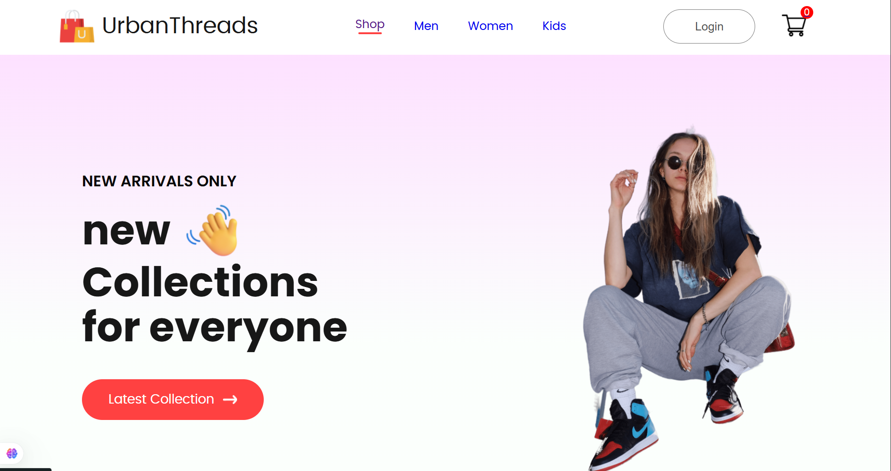
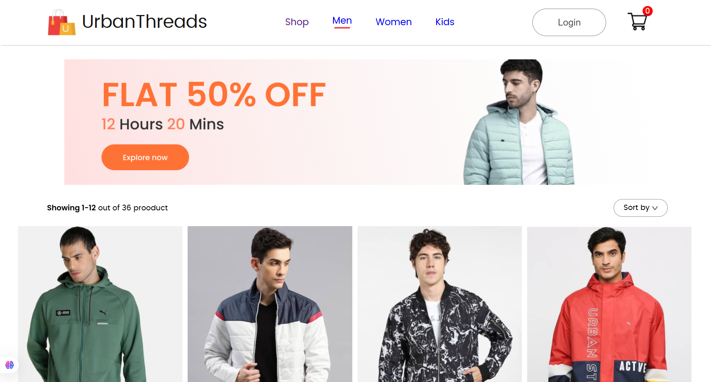
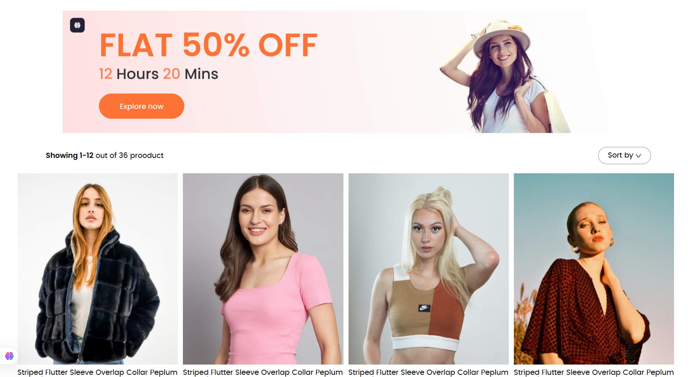

# UrbanThreads

An elegant, responsive e-commerce frontend built with React.js. UrbanThreads showcases a simple, yet powerful UI for browsing categories, viewing product details, managing a shopping cart, and handling user signup—perfect for learning React fundamentals and shipping a portfolio-grade project.

---

## 🚀 Demo

## 📸 Screenshots

---

---

## 🏗️ About the Project
UrbanThreads is a simple yet comprehensive React-based frontend application that simulates an e-commerce storefront. It demonstrates:

- Category-based navigation (Shop, Men, Women, Kids)  
- Dynamic product listing and detail views  
- Cart management (add, update quantity, remove)  
- User signup form with basic validation  
- Responsive, mobile-first design  

This project is ideal as a learning resource or as a foundation for building production-ready e-commerce apps.

---

## 🛠️ Tech Stack
- **Frontend:** React.js (v18+)  
- **Routing:** React Router  
- **State Management:** Context API (or Redux)  
- **Styling:** CSS Modules / Styled Components / Tailwind CSS  
- **Icons:** React Icons (or Heroicons)  

---

## ⚙️ Getting Started

### Prerequisites
- Node.js (>=14.x)  
- npm or yarn  

   
